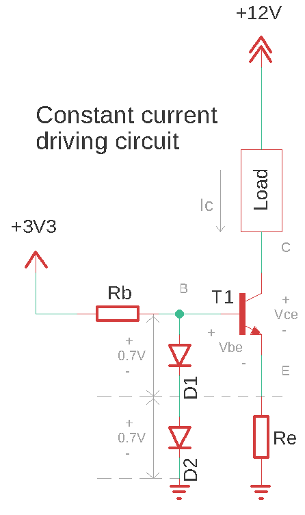
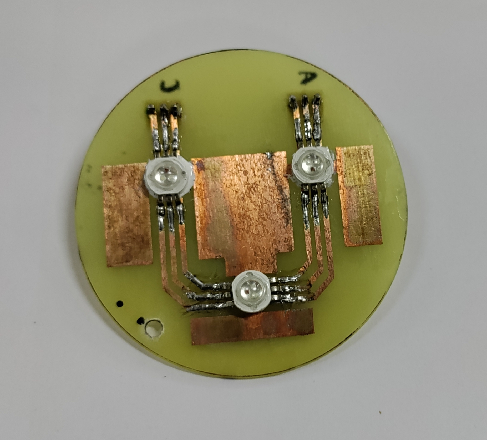
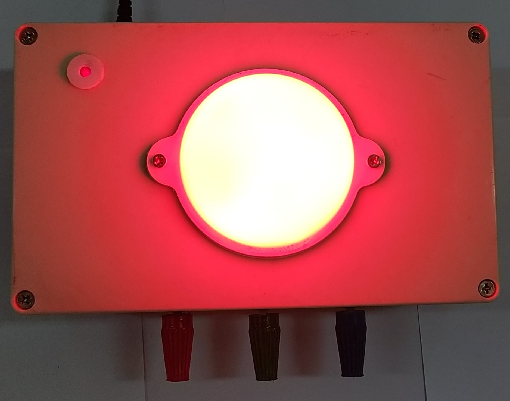

# mood_lamp

‘Mood Lamp’ as the name suggests, enables its user to lighten their room with the colour of their liking. The lamp has two modes of operation-
1. Manually changing the red, blue, and green intensities by turning the knobs provided on the enclosure.
1. Contact-less control using an android app using Bluetooth as the technology for wireless communication.

ESP32 WROOM is used as the microcontroller with 3W RGB LEDs being the illuminant driven by a constant current driving circuit.

## Six Box Model

Every embedded system can be categorised into the following six blocks of operation:

In order to break down our device into these basic building blocks, let's list down the requirements of our device:

- An input mechanism to vary the R, G, B intensities manually.
- A wireless methodology to vary the R, G, B intensities from a distance.
- An LED panel serves as the output of our system.
-  A microcontroller to generate PWM signals controlling the LED circuit.
-  A constant current circuit to drive the LEDs.
-   A supply to power the whole circuit.
-   An enclosure to contain the entire circuitry and be the lamp's body.

1. **INPUTS**: The manual input by turning the knobs is realised by using three 100k panel mount potentiometers whose values are read by the ADC of the microcontroller. In the wireless mode, the inputs are received by the Bluetooth module integrated into the microcontroller and sent by an android app. There is also another input given by a rocker switch deciding the mode of operation of the lamp.
2. **OUTPUT**: The output of the system is represented by the three 3W RGB SMD LEDs located on the LED panel lighting up the lamp. There is also a power-on LED indicating whether the system is connected to a power source or not.
3. **MICROCONTROLLER**: ESP32-WROOM is the microcontroller of choice as it has multiple PWM channels and is integrated with Bluetooth and WiFi capabilities.
4. **POWER SUPPLY**: A 12V-2A DC adapter is used to give raw 12V which supplies the necessary bias to light up the LED panel. Since the microcontroller operates as 3.3V, LM2576 adjustable buck converter is used to provide the necessary voltage levels.
5. **COMMUNICATIONS**: An FTDI programmer is used to download the code from the IDE. A six-pin connector is added to the control board, this makes programming the microcontroller repeatedly a much easier task.

## Project Description

### Block Diagram

### Hardware Description
The hardware of this project consists of two boards:
1. LED Panel: The board for LEDs is separate from the rest of the
  circuitry as they consist of high wattage elements which should be
  isolated to avoid unwanted transfer of heat to other components
  such as the microcontroller.
2. Control circuit: It consists of the microcontroller ESP32, the power
  supply block consisting of a DC barrel jack and the buck converter
  circuit. It also hosts the constant current driving circuit consisting
  of NPN transistors (MJE3055T), diodes (1N4007), and the accom-
  panying resistors for biasing and setting the current to comply
  with the LED specifications and power ratings of the transistors.
  There are heat sinks for the transistors and the buck converter to
  take away excess heat to improve device performance and extend
  its life.

 
 
**Wondering how the current is kept constant?**

Let’s start with the collector current equation giving us insight into what controls the
current through the load.

It is apparent that Ic is exponentially dependent on Vbe. Observe that if the current through the load increases, the voltage drop across Re also increases thereby decreasing Vbe which eventually decreases Ic. This corrective action occurs because the voltage appearing at the base is kept constant by the voltage reference set by the diodes.
Thus the current Ic is kept relatively constant even if the voltage across the load changes.
Now the question arises as to how the intensity of LEDs is varied using the microcontroller. The answer is PWM.

### Software Description
The program for this project is written and compiled on Arduino IDE. The following flowchart explains the logic of code:

## Circuit Design

### LED Panel
|  || 
|:--:| :--:|
| *schematic* |                                                                          *board layout*|

### Control Board
||
|:--:|
|*schematic*|

||
|:--:|
|*board layout*|

## Fabricated PCB

|||
|:--:| :--:|
|*Control circuit PCB*|*LED panel PCB*|

## END RESULT

| |
|:--:|
||
|*Enclosed lamp from different angles*|

| |
|:--:|
||
||
|*Mood Lamp showing different shades.*|

